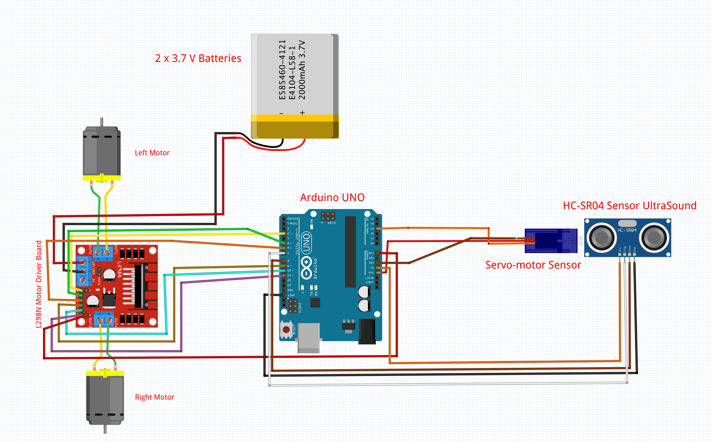

<div align="center">


<br/>

# Wall-E • Autonomous obstacle avoidance

**TIC-RBT1 · Project 1 · ETNA**


</div>

---

> **Course**: TIC-RBT1 — **Due Date**: April 19, 2026  
> **ETNA Co-Labs** · Group of 4

---

## 📋 Table of Contents

1. [Overview](#-overview)
2. [Components](#-components)
3. [Assembly](#-assembly)
4. [Wiring Diagram](#-wiring-diagram)
5. [Code Architecture](#-code-architecture)
6. [Avoidance Logic](#-avoidance-logic)
7. [Main Functions](#-main-functions)
8. [Installation & Usage](#-installation-usage)
9. [Tests & Adjustments](#-tests--adjustments)
10. [Configurable Constants](#-configurable-constants)
11. [Implemented Bonuses](#-implemented-bonuses)
12. [Challenges Encountered](#-challenges-encountered)

---

## 🎯 Overview

This project involves building and programming an **autonomous obstacle-avoidance vehicle** based on the Arduino Uno. The robot continuously follows the fundamental cycle of any embedded system:

```
Perceive → Decide → Act
```

The **HC-SR04** ultrasonic sensor continuously measures the distance to obstacles. Based on this measurement, the Arduino makes a decision: move forward, slow down, or initiate an avoidance maneuver (reverse + turn). The motors are controlled via an **L298N** driver (H-bridge) that manages both direction and speed via PWM.

---

## 🧩 Components

Translated with DeepL.com (free version)

| Component                          | Quantity | Function                                  |
| ---------------------------------- | -------- | ----------------------------------------- |
| Arduino Uno                        | 1        | Microcontroller - system's brain          |
| L298N motor driver                 | 1        | Controls motor speed & direction          |
| HC-SR04 ultrasonic sensor          | 1        | Obstacle detection (distance measurement) |
| DC motors with gearboxes           | 4        | Chassis propulsion                        |
| SunFounder Smart Video Car chassis | 1        | Mechanical structure                      |
| Wheels                             | 4        | Movement                                  |
| 18650 batteries                    | 2        | Power supply (~7.4V in series)            |
| 18650 battery holder               | 1        | Battery support & wiring                  |
| Dupont cables (M/M, M/F)           | several  | Electrical connections                    |
| Screws, nuts, spacers              | several  | Mechanical fastening                      |

---

## 🔧 Assembly

### Chassis

1. Secure the **4 DC motors** in their mounts (2 on each side).
2. Install the **spacers** between the two trays.
3. Place the **wheels** on the motor shafts.
4. Securely attach the **battery holder** to the bottom tray.
5. Reserve space on the **upper plate** for the Arduino and the L298N.
6. Mount the **HC-SR04 at the front**, centered and slightly raised to avoid detecting the ground.

> ⚠️ **Important**: Do not connect the batteries until all wiring has been checked. Reversing the polarity can permanently damage the L298N or the Arduino.

---

## 🔌 Wiring Diagram

|                       Theoretical Diagram                       |                              Live Rendering                              |
| :-------------------------------------------------------------: | :----------------------------------------------------------------------: |
|  |  |

### Motors → L298N

| Motors                      | L298N Terminal |
| --------------------------- | -------------- |
| Left motors (front + rear)  | OUT1 / OUT2    |
| Right motors (front + rear) | OUT3 / OUT4    |

### L298N → Arduino Uno

| L298N Pin | Arduino Pin | Function              |
| --------- | ----------- | --------------------- |
| IN1       | D5          | Left motor direction  |
| IN2       | D6          | Left motor direction  |
| IN3       | D9          | Right motor direction |
| IN4       | D10         | Right motor direction |
| ENA       | D3 _(PWM)_  | Left motor speed      |
| ENB       | D11 _(PWM)_ | Right motor speed     |
| GND       | GND         | Common ground         |

### L298N Power Supply

| L298N Terminal | Source                                              |
| -------------- | --------------------------------------------------- |
| +12V           | Battery pack positive wire (18650 in series ≈ 7.4V) |
| GND            | Battery pack negative wire                          |
| +5V _(output)_ | Optional: can power the Arduino via VIN             |

### HC-SR04 → Arduino Uno

| HC-SR04 Pin | Arduino Pin |
| ----------- | ----------- |
| VCC         | 5V          |
| GND         | GND         |
| TRIG        | D7          |
| ECHO        | D8          |

---

## 🏗️ Code Architecture

```
robot_car.ino
├── Pin definitions
├── Behavior constants
├── setup()
│   ├── pinMode() input/output configuration
│   └── Serial.begin() serial monitor (debug)
├── loop()
│   ├── measureDistance() HC-SR04 reading
│   └── Decision logic (if/else)
├── moveForward(speed)
├── moveBackward(speed)
├── turnRight(speed)
└── stopMotors()
```

---

## 🧠 Avoidance logic

```
Main loop:
  distance ← measureDistance()

  if distance < STOP_THRESHOLD (15 cm):
    stopMotors()
    moveBackward(FULL_SPEED) for 300ms
	turnRight(FULL_SPEED)    for 400ms

  else if distance < SLOW_THRESHOLD (30 cm):
    moveForward(SLOW_SPEED)

  else:
    moveForward(FULL_SPEED)
```

---

## ⚙️ Main functions

| Function              | Description                                                                         |
| --------------------- | ----------------------------------------------------------------------------------- |
| `measureDistance()`   | Sends a TRIG pulse, measures the echo duration via ECHO, returns the distance in cm |
| `moveForward(speed)`  | Activates all 4 motors forward at the specified PWM                                 |
| `moveBackward(speed)` | Activates all 4 motors in reverse at the specified PWM                              |
| `turnRight(speed)`    | Left motors forward, right motors backward - rotation in place                      |
| `stopMotors()`        | Cuts PWM on ENA and ENB - immediate stop                                            |

---

## 🚀 Installation & Usage

### Prerequisites

- [Arduino IDE](https://www.arduino.cc/en/software) (version 1.8.x or 2.x)
- USB-A to USB-B cable (Arduino Uno)
- No external libraries required

### Deployment

```bash
# 1. Clone the repository
git clone https://rendu-git.etna-alternance.net/module-10145/activity-54475/group-1075084

# 2. Open the file in the Arduino IDE
# File → Open → robot_car.ino

# 3. Select the board
# Tools → Board Type → Arduino Uno

# 4. Select the serial port
# Tools → Port → COM* (Windows) or /dev/ttyUSB* (Linux/Mac)

# 5. Upload
# Ctrl+U (or ➜ button)
```

> ⚠️ Place the robot on a **raised surface** (with its wheels off the ground) during initial testing to prevent it from moving unexpectedly.

---

## 🧪 Testing & Adjustments

| Step                                | Description                                          | Tools                        |
| ----------------------------------- | ---------------------------------------------------- | ---------------------------- |
| **1. Sensor only**                  | Display distance every 100 ms, move your hand closer | Serial monitor               |
| **2. Motors only**                  | Move forward, backward, and turn sharply in the code | Direct observation           |
| **3. Complete program, in the air** | Simulate an obstacle with your hand                  | Serial monitor + observation |
| **4. Ground test**                  | Release the robot facing a wall or a box             | Field observation            |
| **5. Fine-tuning**                  | Adjust thresholds and PWM speeds                     | Iterative                    |

---

## 📐 Configurable constants

```cpp
// Detection thresholds
#define STOP_THRESHOLD  20   // cm — obstacle too close, avoidance maneuver
#define SLOW_THRESHOLD  50   // cm — approaching, speed reduction

// PWM speeds (0–255)
#define FULL_SPEED     120   // cruising speed
#define SLOW_SPEED     100   // approach speed

// Operation times (ms)
#define BACKUP_TIME    400   // reverse time
#define TURN_TIME      800   // turn time

// Pins
#define TRIG_PIN  7
#define ECHO_PIN  8
#define IN1  5
#define IN2  6
#define IN3  9
#define IN4  10
#define ENA  3
#define ENB  11
```

---

## ✨ Implemented bonuses

- [x] **Pan servo** — HC-SR04 on SG90 servo, scans left/right before each maneuver
- [x] **Progressive deceleration** — PWM speed calculated linearly based on distance

---

## ⚡ Challenges Encountered

- **Battery**: When inserting the batteries, the positive terminal did not seat properly, causing a loose connection.

- **Speed Issue**: When the car went too fast, it turned correctly, but at an appropriate speed it turned poorly, so we separated the functions for each speed.

- **The kit**: The basic kit was unsuitable and incomplete; we needed a Raspberry Pi instead of an Arduino.

- **Servo motor**: While implementing the bonus manual mode via IR remote control, the servo motor sensor at the front of our Wall-E failed.

---

<div align="center">

_Project completed at Co-Labs ETNA · ICT-RBT1 Module · April 2026_

`corde_t` · `judea_d` · `kingki_n` · `brouar_l`

</div>
